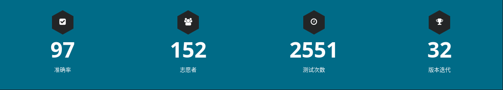
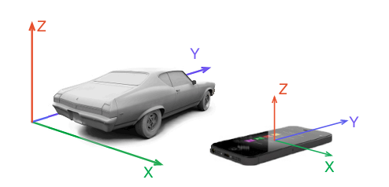
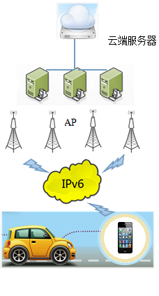
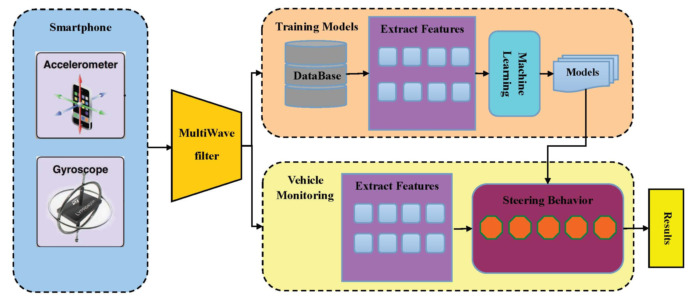
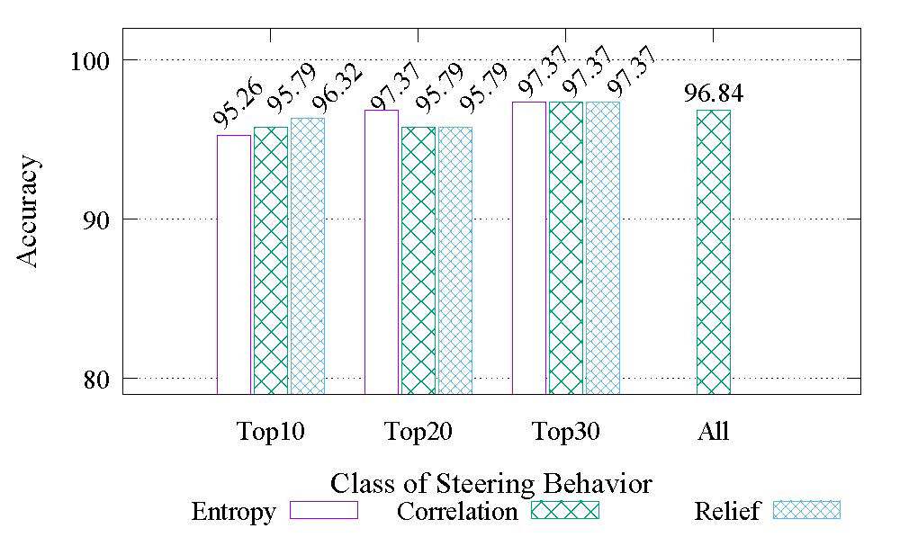
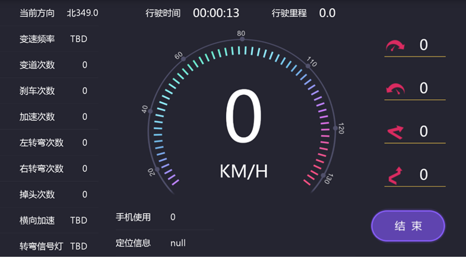

# VEHICLE STEERING DETECTOR

## 实时分析驾驶行为

有调查显示，交通事故往往是由驾驶员危险驾驶行为所引起的，及时检测这些行为并进行预警对于避免交通事故至关重要。车载诊断系统OBD(On-Board Diagnostic)和高级驾驶辅助系统ADAS(Advanced Driver Assistant System)造价昂贵，因此通常不适用于大众车型。随着智能设备的发展，智能手机的快速发展和强大的内置传感器是解决此问题的新途径。

目前，移动智能设备如：手机、平板电脑、车载计算机等，计算能力可以达到一般PC机的水平；同时，随着网络通信的不断发展，内置WiFi、蓝牙和4G的移动芯片的移动终端的通讯速率不断加快．此外，移动设备中集成的传感器，如光强传感器、加速度传感器、陀螺仪、磁力计、摄像头等，使得移动设备具备对周边环境的强大感知能力。

本研究主要...

## 成果

### 采集平台的实现

- 通过无线网络
- Android智能移动端采集系统
- 通过众包技术的采集策略对数据

### 行驶数据采集

- 不同车型的车辆
- 不同类型的智能终端
- 不同水平的驾驶员

### 行驶模式识别

- Hadoop云平台
- MultiWave波形识别算法

### 学术转化

- 会议论文: IEEE ICC2016
- 会议论文: IEEE ISPA2017
- 期刊论文:《华科学报自然版》
- 专利3项

### 产品

- Android Application
- [开源项目: VEHICLE STEERING DETECTOR](https://github.com/ouyangkid/vehiclesteeringdetection)
- 智能终端

## 数据集
| No. | Date | Size | Download |
| ------ | ------ | ------ | ------ |
| 1. | 20150806 | 1201351 | [20150806 sensor (2).txt](https://raw.githubusercontent.com/ouyangkid/vehiclesteeringdetection/master/doc/data/sensordata/20150806%20sensor%20%282%29.txt) |
| 2. | 20150806 | 3707770 | [20150806 sensor (3).txt](https://raw.githubusercontent.com/ouyangkid/vehiclesteeringdetection/master/doc/data/sensordata/20150806%20sensor%20%283%29.txt) |
| 3. | 20150806 | 423722 | [20150806 sensor.txt](https://raw.githubusercontent.com/ouyangkid/vehiclesteeringdetection/master/doc/data/sensordata/20150806%20sensor.txt) |
| 4. | 20150819 | 811460 | [20150819 sensor (2).txt](https://raw.githubusercontent.com/ouyangkid/vehiclesteeringdetection/master/doc/data/sensordata/20150819%20sensor%20%282%29.txt) |
| 5. | 20150819 | 6067677 | [20150819 sensor (3).txt](https://raw.githubusercontent.com/ouyangkid/vehiclesteeringdetection/master/doc/data/sensordata/20150819%20sensor%20%283%29.txt) |
| 6. | 20150819 | 1804186 | [20150819 sensor.txt](https://raw.githubusercontent.com/ouyangkid/vehiclesteeringdetection/master/doc/data/sensordata/20150819%20sensor.txt) |
| 7. | 20150829 | 1491887 | [20150829 sensor (2).txt](https://raw.githubusercontent.com/ouyangkid/vehiclesteeringdetection/master/doc/data/sensordata/20150829%20sensor%20%282%29.txt) |
| 8. | 20150829 | 191861 | [20150829 sensor.txt](https://raw.githubusercontent.com/ouyangkid/vehiclesteeringdetection/master/doc/data/sensordata/20150829%20sensor.txt) |
| 9. | 20150831 | 1203724 | [20150831 sensor.txt](https://raw.githubusercontent.com/ouyangkid/vehiclesteeringdetection/master/doc/data/sensordata/20150831%20sensor.txt) |
| 10. | 20151009 | 90852 | [20151009 sensor.txt](https://raw.githubusercontent.com/ouyangkid/vehiclesteeringdetection/master/doc/data/sensordata/20151009%20sensor.txt) |
| 11. | 20151010 | 843461 | [20151010 sensor (2).txt](https://raw.githubusercontent.com/ouyangkid/vehiclesteeringdetection/master/doc/data/sensordata/20151010%20sensor%20%282%29.txt) |
| 12. | 20151010 | 4202704 | [20151010 sensor (3).txt](https://raw.githubusercontent.com/ouyangkid/vehiclesteeringdetection/master/doc/data/sensordata/20151010%20sensor%20%283%29.txt) |
| 13. | 20151010 | 6532 | [20151010 sensor.txt](https://raw.githubusercontent.com/ouyangkid/vehiclesteeringdetection/master/doc/data/sensordata/20151010%20sensor.txt) |
| 14. | 20151019 | 55402 | [20151019 sensor.txt](https://raw.githubusercontent.com/ouyangkid/vehiclesteeringdetection/master/doc/data/sensordata/20151019%20sensor.txt) |
| 15. | 20151020 | 2719 | [20151020 sensor.txt](https://raw.githubusercontent.com/ouyangkid/vehiclesteeringdetection/master/doc/data/sensordata/20151020%20sensor.txt) |
| 16. | 20151117 | 525960 | [20151117 sensor (2).txt](https://raw.githubusercontent.com/ouyangkid/vehiclesteeringdetection/master/doc/data/sensordata/20151117%20sensor%20%282%29.txt) |
| 17. | 20151117 | 1238802 | [20151117 sensor.txt](https://raw.githubusercontent.com/ouyangkid/vehiclesteeringdetection/master/doc/data/sensordata/20151117%20sensor.txt) |
| 18. | 20160216 | 1877241 | [20160216 sensor (2).txt](https://raw.githubusercontent.com/ouyangkid/vehiclesteeringdetection/master/doc/data/sensordata/20160216%20sensor%20%282%29.txt) |
| 19. | 20160216 | 5651357 | [20160216 sensor (3).txt](https://raw.githubusercontent.com/ouyangkid/vehiclesteeringdetection/master/doc/data/sensordata/20160216%20sensor%20%283%29.txt) |
| 20. | 20160216 | 2814243 | [20160216 sensor (4).txt](https://raw.githubusercontent.com/ouyangkid/vehiclesteeringdetection/master/doc/data/sensordata/20160216%20sensor%20%284%29.txt) |
| 21. | 20160216 | 685796 | [20160216 sensor.txt](https://raw.githubusercontent.com/ouyangkid/vehiclesteeringdetection/master/doc/data/sensordata/20160216%20sensor.txt) |
| 22. | 20160303 | 2249514 | [20160303 sensor (2).txt](https://raw.githubusercontent.com/ouyangkid/vehiclesteeringdetection/master/doc/data/sensordata/20160303%20sensor%20%282%29.txt) |
| 23. | 20160303 | 3202839 | [20160303 sensor (3).txt](https://raw.githubusercontent.com/ouyangkid/vehiclesteeringdetection/master/doc/data/sensordata/20160303%20sensor%20%283%29.txt) |
| 24. | 20160303 | 928598 | [20160303 sensor.txt](https://raw.githubusercontent.com/ouyangkid/vehiclesteeringdetection/master/doc/data/sensordata/20160303%20sensor.txt) |
| 25. | 20160305 | 1468869 | [20160305 sensor (2).txt](https://raw.githubusercontent.com/ouyangkid/vehiclesteeringdetection/master/doc/data/sensordata/20160305%20sensor%20%282%29.txt) |
| 26. | 20160305 | 4324636 | [20160305 sensor (3).txt](https://raw.githubusercontent.com/ouyangkid/vehiclesteeringdetection/master/doc/data/sensordata/20160305%20sensor%20%283%29.txt) |
| 27. | 20160305 | 1716295 | [20160305 sensor (4).txt](https://raw.githubusercontent.com/ouyangkid/vehiclesteeringdetection/master/doc/data/sensordata/20160305%20sensor%20%284%29.txt) |
| 28. | 20160305 | 11962793 | [20160305 sensor.txt](https://raw.githubusercontent.com/ouyangkid/vehiclesteeringdetection/master/doc/data/sensordata/20160305%20sensor.txt) |
| 29. | 20170114 | 1215041 | [20170114 sensor (2).txt](https://raw.githubusercontent.com/ouyangkid/vehiclesteeringdetection/master/doc/data/sensordata/20170114%20sensor%20%282%29.txt) |
| 30. | 20170114 | 657851 | [20170114 sensor (3).txt](https://raw.githubusercontent.com/ouyangkid/vehiclesteeringdetection/master/doc/data/sensordata/20170114%20sensor%20%283%29.txt) |
| 31. | 20170114 | 682662 | [20170114 sensor (4).txt](https://raw.githubusercontent.com/ouyangkid/vehiclesteeringdetection/master/doc/data/sensordata/20170114%20sensor%20%284%29.txt) |
| 32. | 20170114 | 1221963 | [20170114 sensor (5).txt](https://raw.githubusercontent.com/ouyangkid/vehiclesteeringdetection/master/doc/data/sensordata/20170114%20sensor%20%285%29.txt) |
| 33. | 20170114 | 682662 | [20170114 sensor.txt](https://raw.githubusercontent.com/ouyangkid/vehiclesteeringdetection/master/doc/data/sensordata/20170114%20sensor.txt) |

## 实验结果

### 大数据

数据规模大，可以发现事物内部的联系

### 采集坐标系

表明手机和传感器方向

### 网络

网络部署

### 结构

系统架构

### 准确率

实验准确率

### UI

系统的UI Design

## 应用下载

[Android客户端下载](http://github.com)

暂不支持IOS环境，敬请期待